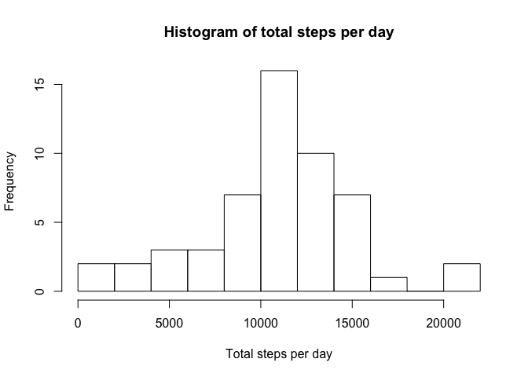
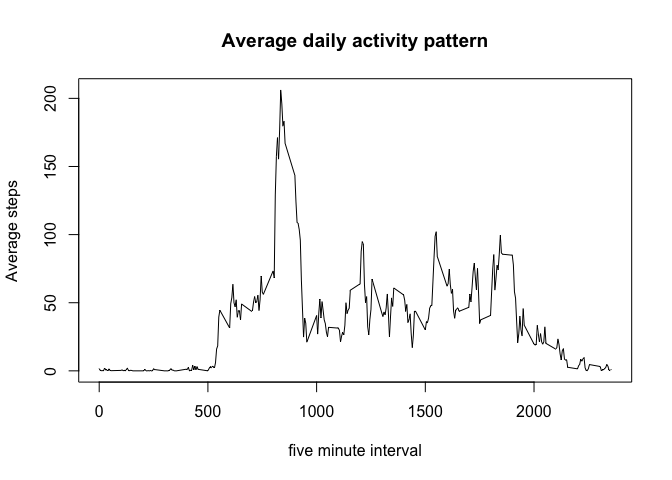
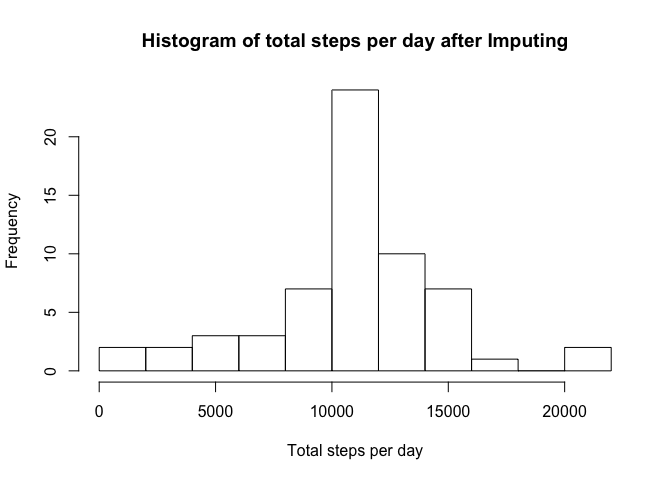
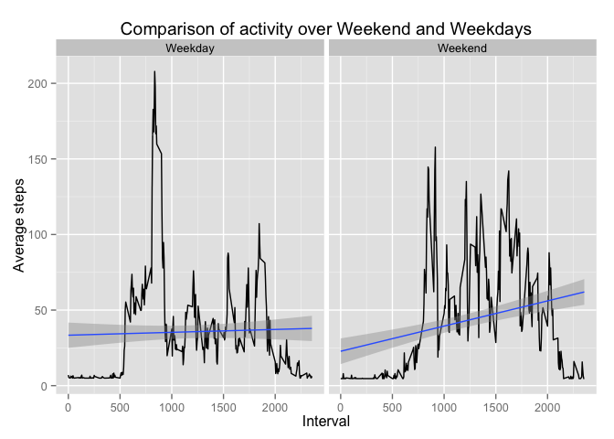

# Reproducible Research: Peer Assessment 1


## Loading and preprocessing the data


```r
library("knitr")
require('knitr')
opts_chunk$set(echo=TRUE,results=TRUE)
indata<-read.csv("activity.csv")
# check summary of the data
head(indata)
```

```
##   steps       date interval
## 1    NA 2012-10-01        0
## 2    NA 2012-10-01        5
## 3    NA 2012-10-01       10
## 4    NA 2012-10-01       15
## 5    NA 2012-10-01       20
## 6    NA 2012-10-01       25
```

```r
summary(indata)
```

```
##      steps                date          interval     
##  Min.   :  0.00   2012-10-01:  288   Min.   :   0.0  
##  1st Qu.:  0.00   2012-10-02:  288   1st Qu.: 588.8  
##  Median :  0.00   2012-10-03:  288   Median :1177.5  
##  Mean   : 37.38   2012-10-04:  288   Mean   :1177.5  
##  3rd Qu.: 12.00   2012-10-05:  288   3rd Qu.:1766.2  
##  Max.   :806.00   2012-10-06:  288   Max.   :2355.0  
##  NA's   :2304     (Other)   :15840
```

```r
colnames(indata)
```

```
## [1] "steps"    "date"     "interval"
```

```r
str(indata)
```

```
## 'data.frame':	17568 obs. of  3 variables:
##  $ steps   : int  NA NA NA NA NA NA NA NA NA NA ...
##  $ date    : Factor w/ 61 levels "2012-10-01","2012-10-02",..: 1 1 1 1 1 1 1 1 1 1 ...
##  $ interval: int  0 5 10 15 20 25 30 35 40 45 ...
```
## Calculate mean total number of steps taken per day

```r
indata<-subset(indata,!(is.na(indata$steps)))
                                 
y<-as.Date(indata$date,"%Y-%m-%d")
# average per day
aggtotal<-aggregate(indata$steps,by=list(y),FUN=sum)
hist(as.vector(aggtotal[,2]),breaks=10,main="Histogram of total steps per day",xlab="Total steps per day", ylab="Frequency")
```

 

```r
#Mean and median steps
dmean<-mean(aggtotal[,2])
dmed<-median(aggtotal[,2])
agginterval<-aggregate(indata$steps,by=list(indata$interval),FUN=mean)
```

## What is mean total number of steps taken per day?
Mean and median of the total number of steps per day is 10766.19, 10765, respectively

## What is the average daily activity pattern?


```r
# average daily activity vs interval
agginterval<-aggregate(indata$steps,by=list(indata$interval),FUN=mean)
plot(agginterval[,1],agginterval[,2],type="l",main="Average daily activity pattern",xlab="five minute interval",ylab="Average steps")
```

 

```r
index<-which.max(agginterval[,2])
```
The average daily activity pattern is maximum during the interval 835.

## Imputing missing values

```r
indatafull<-read.csv("activity.csv")
a<-is.na(indatafull$steps)
nimpute<-sum(a)
#fill missing values by means
indatafull$steps[is.na(indatafull$steps)]<-mean(indatafull$steps,na.rm=TRUE)
# average per day
yall<-as.Date(indatafull$date,"%Y-%m-%d")
aggtotalall<-aggregate(indatafull$steps,by=list(yall),FUN=sum)
hist(as.vector(aggtotalall[,2]),breaks=10,main="Histogram of total steps per day after Imputing",xlab="Total steps per day", ylab="Frequency")
```

 

```r
str(aggtotalall)
```

```
## 'data.frame':	61 obs. of  2 variables:
##  $ Group.1: Date, format: "2012-10-01" "2012-10-02" ...
##  $ x      : num  10766 126 11352 12116 13294 ...
```

```r
dmeanall<-mean(aggtotalall[,2])
dmedall<-median(aggtotalall[,2])
```
The number of rows with data missing on steps are 2304.
After imputing, the mean and the median of the total number of steps per day is 10766.19, 10766.19, respectively
The percent difference in mean activity before and after imputation is 
0.
The percent difference in median activity before and after imputation is 
-0.01104207.

The  missing values did not significantly impact the mean and the median measures.

## Are there differences in activity patterns between weekdays and weekends?

```r
library(ggplot2)
# get weekday information
indatafull$day<-weekdays(as.Date(indatafull$date,"%Y-%m-%d"))
#indatafull$period<-ifelse(indatafull$day=="Saturday" | indatafull$day=="Sunday","Weekend","Weekday")
# create factor variable using Weekday information
indatafull$period<-factor(indatafull$day=="Saturday" | indatafull$day=="Sunday")
levels(indatafull$period)[levels(indatafull$period)=="TRUE"]<-"Weekend"
levels(indatafull$period)[levels(indatafull$period)=="FALSE"]<-"Weekday"
# check the new structure of the imputed data after adding new column
str(indatafull)
```

```
## 'data.frame':	17568 obs. of  5 variables:
##  $ steps   : num  37.4 37.4 37.4 37.4 37.4 ...
##  $ date    : Factor w/ 61 levels "2012-10-01","2012-10-02",..: 1 1 1 1 1 1 1 1 1 1 ...
##  $ interval: int  0 5 10 15 20 25 30 35 40 45 ...
##  $ day     : chr  "Monday" "Monday" "Monday" "Monday" ...
##  $ period  : Factor w/ 2 levels "Weekday","Weekend": 1 1 1 1 1 1 1 1 1 1 ...
```

```r
# compute average activity per interval
aggperiod<-aggregate(indatafull$steps,by=list(indatafull$interval,indatafull$period),FUN=mean)
str(aggperiod)
```

```
## 'data.frame':	576 obs. of  3 variables:
##  $ Group.1: int  0 5 10 15 20 25 30 35 40 45 ...
##  $ Group.2: Factor w/ 2 levels "Weekday","Weekend": 1 1 1 1 1 1 1 1 1 1 ...
##  $ x      : num  7.01 5.38 5.14 5.16 5.07 ...
```

```r
#plot
qplot(Group.1,x,data=aggperiod,facets=.~Group.2,geom=c("line","smooth"),method="lm",main="Comparison of activity over Weekend and Weekdays",xlab="Interval",ylab="Average steps")
```

 

Looking at the regression fit lines, the average activity over the weekend appears to be higher than that over the weekdays. The time-series plot during the weekdays shows that the average activity during the early intervals is higher than the later intervals. The time-series plot during the weekends, suggest that the average activity remains similar throughout the day.
